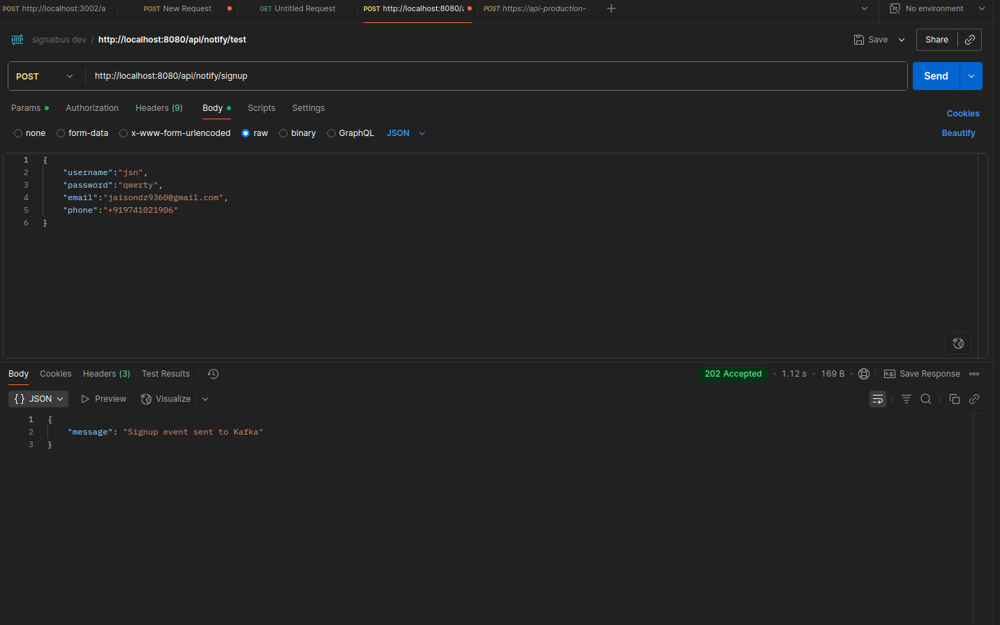

# Signalbus

**Signalbus** is a cloud-native, event-driven notification hub built with Go, Kafka, Docker, and cloud APIs (Mailgun, Twilio). It handles real-time email and SMS notifications through scalable microservices. Based on various events the data is put kafka through which the microservices get the data. Here microservices send emails and SMS. Its a simulation and a learning project.

---




---

## Features (completed per todo)

- `/publish/:topic` and `/notify` endpoints
- Kafka producer keyed by user; workers for email and SMS
- Email worker with retry + DLQ; Prometheus metrics and JSON logs
- SMS worker with retry + DLQ + per-tenant rate limit; Prometheus metrics
- Idempotency keys (DB unique index + cache)
- API key authentication; short- and long-term rate limiting
- PostgreSQL schema for notifications, attempts, keys, templates; search and redrive endpoints
- Templates with Go templates and localization
- Policy-driven fan-out honoring preferences
- Observability: standardized metrics, Grafana dashboards, OpenTelemetry tracing, alerting rules
- Multi-tenancy: tenant column propagation, scoped queries, quotas

---

## Architecture

```

Client Services (e.g., Order, Auth)
|
v
[ Notification API Service ]
|
v
Kafka Topics
|
v
[Email Worker] \[SMS Worker] \[Future Workers...]
|
v
Mailgun & Twilio

```

---

## Services

| Service          | Description                           |
| ---------------- | ------------------------------------- |
| Notification API | Accepts events and publishes to Kafka |
| Email Worker     | Listens to Kafka and sends emails     |
| SMS Worker       | Listens to Kafka and sends SMS        |
| Kafka/Zookeeper  | Message broker infrastructure         |
| Prometheus       | Metrics collector                     |
| Grafana          | Dashboard visualization               |

---

## Tech Stack

- **Go** - Core microservices and libraries (`pkg/gomailer`, `pkg/gosms`)
- **Kafka (segmentio/kafka-go)** - Event distribution with consumer groups
- **Docker / Docker Compose** - Containerization and local orchestration
- **Mailgun API + SMTP** - Email delivery with fallback support
- **Twilio API** - SMS delivery with E.164 normalization
- **PostgreSQL** - Persistence for notifications, attempts, templates, tenants
- **Redis** - Caching and idempotency key storage
- **Prometheus + Grafana** - Metrics collection and visualization
- **OpenTelemetry** - Distributed tracing across services
- **Railway + GitHub Actions** - Cloud deployment and CI/CD pipeline

---

## Setup Instructions

### 1. Clone the Repo

```bash
git clone https://github.com/jsndz/signalbus.git
cd signalbus
```

### 2. Environment Variables

Rename `.env.example`to `.env` and replace the variables

### 3. Run Locally with Docker

```bash
docker-compose up --build
```

### 4. Trigger an Event

Test with Postman or curl:

```bash
curl -X POST http://localhost:8080/notify/signup \
     -H "Content-Type: application/json" \
     -d '{"email": "user@example.com", "phone": "+11234567890"}'
```

---

## Docker Setups

How to Run Kafka separately:

- Run the docker image of `Kafka` and `zoo-keeper` (image details in docker-compose.yml)

Run docker compose(recommended):

- cd notification_hub
- docker compose build
- docker compose up -d

See logs:

- docker compose logs -f api
- docker compose logs -f email
- docker compose logs -f sms

Running API and Worker Separately (Manual Build):

- docker build -f deployments/Dockerfile.api -t notification_hub:latest .
- docker run -p 8080:8080 notification_hub:latest

- docker build -f deployments/Dockerfile.email -t email:latest .
- docker run -p 3001:3001 email:latest

- docker build -f deployments/Dockerfile.sms -t sms:latest .
- docker run -p 3000:3000 sms:latest

Stop everything:

- docker compose down

Example curl request:

```sh
curl -X POST http://localhost:8080/api/notify/signup \
     -H "Content-Type: application/json" \
     -d '{"username":"jsn", "password":"qwerty","email": "user@example.com", "phone": "+11234567890" }'

```

Response Example:

```json
{
  "message": "Signup event sent to Kafka"
}
```

Logs:

```md
email-1 | 2025/07/10 09:54:26 jsn qwerty
sms-1 | 2025/07/11 14:52:38 SMS sent to +91XXXXXXXXXX! Message SID: SMfXXXXXXXXXXXXXXXXXXXXXXXXXXX
email-1 | 202
```

Topics Learned:

- Docker compose
- Twilio and Sendgrid Integration
- Kafka Producer and Consumer
- Kafka Retry Logics
- makefile
- Grafana + prometheus
- logging with zap

---

## Observability

- Visit Prometheus: `http://localhost:9090`
- Visit Grafana: `http://localhost:3002` (default login: `admin/admin`)

---

## Deployment

- Services are deployed on [Railway](https://railway.app)
- GitHub Actions handle CI/CD on push to `main`
- Kafka managed via Railway Add-on or Upstash

---

## Completed (from todo)

- [x] `pkg/gomailer`: interface + SMTP + Mailgun drivers; timeouts/retries; unit tests
- [x] Email worker: consumes `notifications.email`, retry + DLQ, metrics, JSON logs
- [x] `pkg/gosms`: interface; Twilio/Vonage drivers; E.164 normalization
- [x] SMS worker: retry + DLQ + per-tenant rate limit; metrics
- [x] API: `/publish/:topic`, `/notify`; API key auth; short/long-term rate limits
- [x] Idempotency keys (DB unique index + cache)
- [x] OpenAPI spec + Swagger UI
- [x] Kafka producer keyed by user (idempotent)
- [x] Postgres: schemas for notifications, attempts, keys, templates
- [x] Search + `GET /notifications/:id`; `POST /notifications/:id/redrive`
- [x] Templates (Go tmpl) + localization; policy engine
- [x] Observability: standardized metrics, Grafana dashboards, OTel tracing, alerting rules
- [x] Multi-tenant: tenant column, scoped queries, per-tenant quotas

---

## Contributing

Pull requests are welcome! Open an issue first for feedback or discussion.

---

## Implementation Status

**Current Phase**: Advanced production-ready features (Phases 6-7 complete)

**Key Libraries Built**:
- `pkg/gomailer` - Reusable email library with SMTP and Mailgun drivers
- `pkg/gosms` - Reusable SMS library with Twilio driver and E.164 normalization
- `pkg/kafka` - Kafka producer/consumer abstractions
- `pkg/templates` - Template engine with localization support

**Production Patterns Implemented**:
- Idempotency keys for duplicate prevention
- Exponential backoff retry with jitter
- Dead Letter Queue (DLQ) for failed messages
- Multi-tenant rate limiting and quotas
- Comprehensive observability with metrics, tracing, and logging
- API key authentication and authorization
- Template-based content rendering
